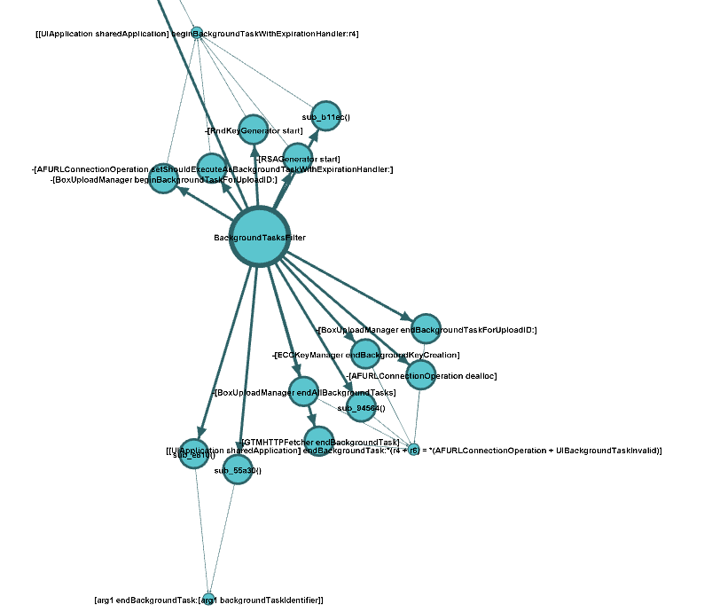

See VizAsm in action
====================

Hopper
------

Annotation
^^^^^^^^^^
VizAsm can annotate your assembler code!
Consider e.g. the following method:

.. code-block:: objective-c
	
	- (void)method:(int)param1 paramname2:(int)param2 {
		[self method:param1 paramname2:0];
	}

And take a look at the annotation:


This is just one example, VizAsm is also capable of annotating the instance variables.

Security Audit
--------------

VizAsm has a few standard filters which you can use to perform a security audit.
If you're not satisfied with the available filters, just write your own and use it ;)

The following pictures show the results in `Gephi <http://gephi.org/>`_ . But they are also viewable as text file.
Choose whatever you like more.

Filters
^^^^^^^

.. image:: images/methodcall_f.png

Detail view
```````````


Explore the graph
`````````````````
.. image:: images/gephi_inspect.png

Method call graph
-----------------

You can even create a call graph without any filters at all to reverse engineer the application or get an idea of the internal structure.

Application with ~ 100 loc
^^^^^^^^^^^^^^^^^^^^^^^^^^

.. image:: images/methodcall_nf_100.png

~10.000 loc
^^^^^^^^^^^

.. image:: images/methodcall_nf_10k.png
