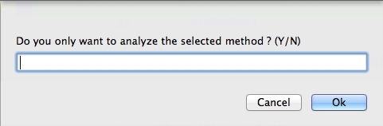
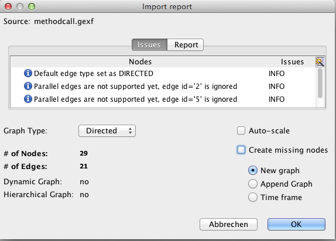
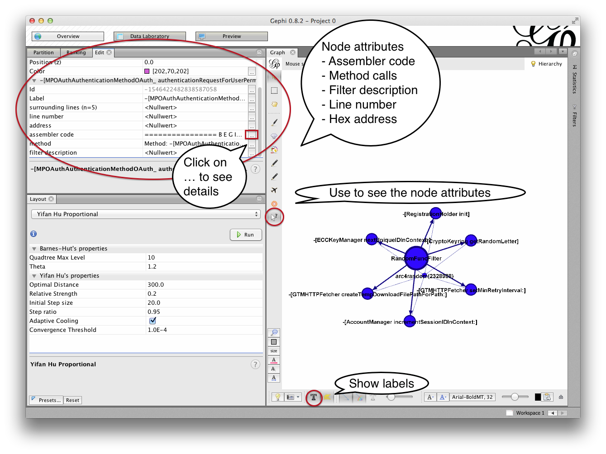

Usage
=====
There are two possible ways of using VizAsm.
The first is from inside Hopper and the second via command line.

If you are just playing around with the demo version of Hopper, then use the VizAsm script to run it from inside Hopper.
This is at least working for the Mac. But the command line seems to be faster than running from inside Hopper.

To run it from the command line, you need to export the .asm file (the demo version is not capable of exporting the .asm file).

.. warning::

	For iOS applications have a look at the section Arm before you start. 

Arm
---

The arm applications are encrypted with the fairplay encryption.
You have to find a solution for this yourself ;)
If you have an apple developer account, you can build your applications for adhoc distribution.
This way, it doesn't get encrypted.
If you just want to play around a bit, have a look at the files/ folders. There are a few .hop files.

Hopper currently does not the same good job on the arm architecture like it does it for x86_64.

So you have to use a few scripts before you can actually start.

The first is the "Add CFString Inline Comments" script from `phracker <https://github.com/phracker/HopperScripts>`_. Its needed to annotate strings.
The second is already shipped with VizAsm and is called vizasm_arm_helper.py . It annotates the instance variables, so VizAsm can track them.

Be sure to run both scripts before you start the analysis with VizAsm.

Cli
---

I just give you a few examples how to run VizAsm.

.. code-block:: sh
	
	# just write the method calls out and create a call graph
	# the last argument specifies the architecture (available: x86, x86_64, arm)
	./VizAsm.py files/asm/x86_64/complete/SecureObjectiveC.asm -o methodcall.txt -g methodcall.gexf x86_64

	# same with standard filters enabled
	#  -af, --all-filters    use all standard filters
	./VizAsm.py files/asm/x86_64/complete/SecureObjectiveC.asm -o methodcall.txt -g methodcall.gexf -af x86_64 

	# if you want to get the argument for the c functions use the -cfh switch
	# -cfh, --c-func-heuristic
	#                    use a heuristic to determine the arguments for a c
	#                    function call (~2x slower) [default: False]
	./VizAsm.py files/asm/x86_64/complete/SecureObjectiveC.asm -o methodcall.txt -g methodcall.gexf -af -cfh x86_64 

	# in the default mode, VizAsm only reads Objective-C methods
	# if you want to let it read all methods that it can, use the -ram switch
	#  -ram, --read-all-methods
	#                    read all methods (not only Objective-C ones)
	 ./VizAsm.py files/asm/x86_64/complete/SecureObjectiveC.asm -o methodcall.txt -g methodcall.gexf -af -cfh -ram x86_64

	 # The default behaviour of VizAsm then it encounters an exception is to skip the whole method
	 # but if you want to get more results for filtering, you can tell it to just ignore the current line where 
	 # the exception occurred and go on
	 # Attention: this leads to wrong results! E.g. wrong arguments being passed to a function!
	 #  -dse, --dont-skip-exception
	 #                   if enabled the analysis of the current method will not
	 #                   be skipped if any exception occurs [default: False]
	  ./VizAsm.py files/asm/x86_64/complete/SecureObjectiveC.asm -o methodcall.txt -g methodcall.gexf -af -cfh -ram -dse x86_64

	 # to supply own filters use the -sf switch
	 #  -sf FILTERS [FILTERS ...], --supply-filters FILTERS [FILTERS ...]
	 #                   supply own filters (has to be last argument)
	 # you can use -af and -sf together!
	 ./VizAsm.py files/asm/x86_64/complete/SecureObjectiveC.asm -o methodcall.txt -g methodcall.gexf -cfh -ram x86_64 -sf FrameworkClassFilter

Hopper
------

.. warning::

	The usage of VizAsm from inside Hopper is currently only working for the Mac!
	Maybe with the next version of Hopper it will even work for Linux and Windows.

The usage from inside Hopper is very similiar. But you have to set all options in the config file vizasm_hopper.py .
The most important part is to set the path to VizAsm.

.. code-block:: sh

	VIZASM_FILEAPTH = '/path'

The other options are explained inside the script. Just have a look at `vizasm_hopper.py <../vizasm/hopper/scripts/vizasm_hopper.py>`_. 

VizAsm enables you to either analyze the whole .asm file or only a single method.
If you choose the latter, you have to selected the method yourself !

This means to mark from "================ B E G I N   O F   P R O C E D U R E ================"
to the end of the method. Mostly until the next procedure beginning (without it!).
To mark means to select the method lines.

Type "n" to analyze the whole file or "y" to analyze a single procedure.

VizAsm can annotate your assembler code at the cost of performance.
So you may just want to annotate very small disassemblies or single methods ;)

Gephi
-----

Import
^^^^^^

To view the call graph or the results of the security audit, open the genereated .gexf file with `Gephi <http://gephi.org/>`_.

.. warning::

	Be sure to uncheck "Auto-Scale" and "Create missing nodes".
	The first destroys the VizAsm supplied graph formatting and the latter creates nodes for which an equal node already exists. 

Then select "Yifan Hu Proportional" in the layout window.
Use 300.0 as optimal distance and run it.

If the nodes are still to close together, run the algorithm again.

For very big graphs, use "ForceAtlas 2" (faster) first until the nodes have been grouped together and then try with "Yifan Hu Proportional" again.

Graph exploration
^^^^^^^^^^^^^^^^^

To show the labels, click on the big "T" at the bottom.
To inspect the graph click on the cursor with the question mark in the "Graph" window.
This enables you to see a few attributes in the left corner.

Depending on which node you selected you can view different information.

- Filter node
	- filter description

- Method implementation node
	- assembler code of the method
	- all method calls which have been read

- Method call node
	- hex address
	- line number
	- surrounding method calls

